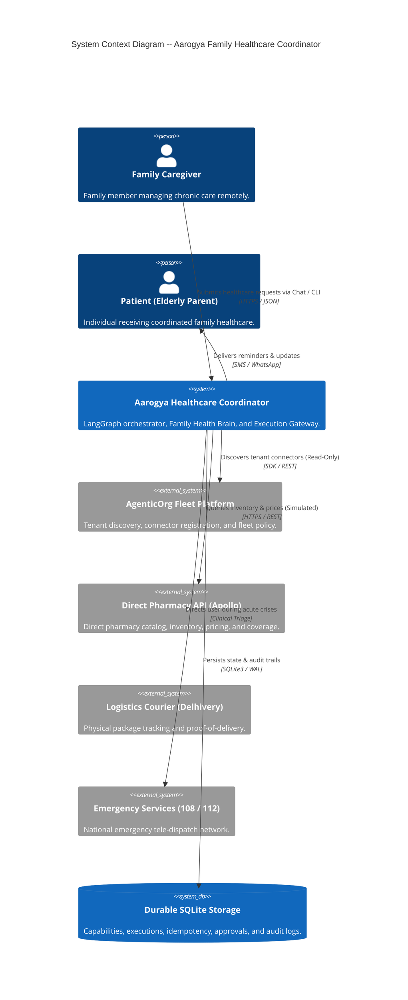
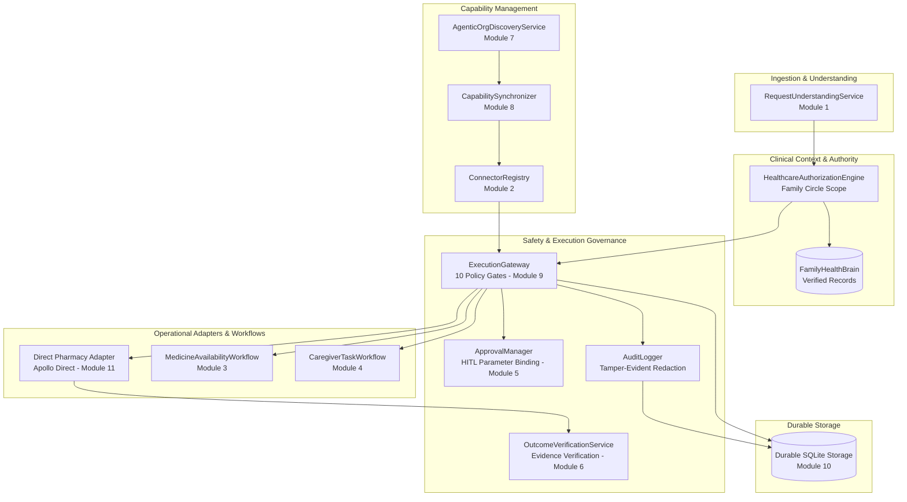
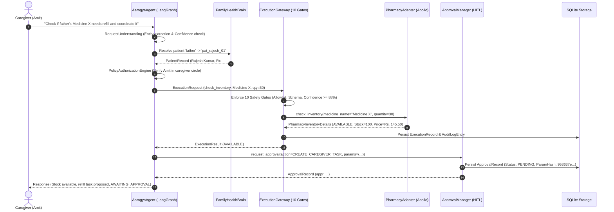
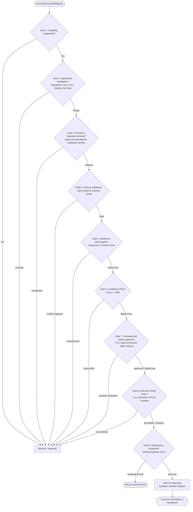
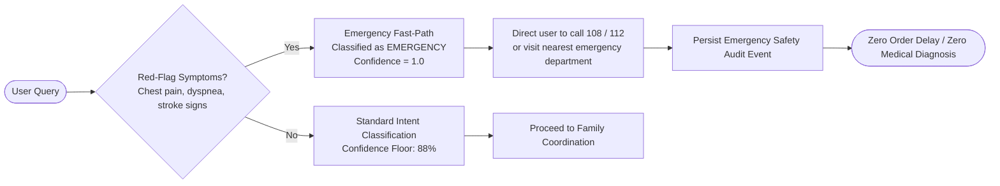
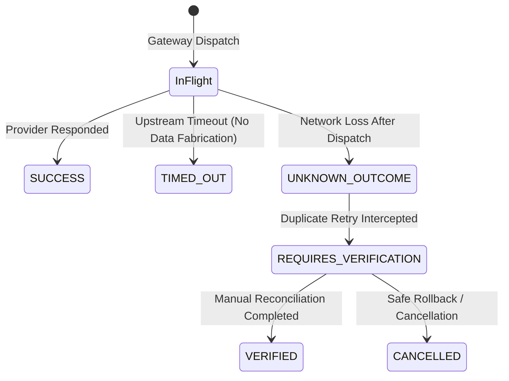

# Aarogya Architecture Overview
### Comprehensive System Context, Operational Workflows, Safety Gates, and Integration Boundaries

---

## 1. System Context & Operational Architecture

Aarogya is an AI-powered Family Healthcare Coordination Agent designed to orchestrate complex chronic care workflows for families. Built using Python 3.11, LangGraph, Pydantic, and AgenticOrg, Aarogya bridges family caregivers, elderly patients, verified clinical prescriptions, and external healthcare providers (pharmacies, logistics, and task backends).

---

## 2. Core Components & Responsibilities

The codebase in `aarogya/` is organized into modular services with strict separation of concerns:

| Component | Primary Responsibility | Key Files |
|---|---|---|
| **RequestUnderstandingService** | Entity extraction, intent classification, red-flag emergency symptom detection, and confidence scoring. | `aarogya/understanding/request_parser.py` |
| **FamilyHealthBrain** | Verified patient records, active doctor prescriptions, household medicine stock, and authorized family circles. | `aarogya/brain/family_health_brain.py` |
| **HealthcareAuthorizationEngine** | Fine-grained permission checks ensuring caregivers only access authorized patient records. | `aarogya/orchestrator/agent.py` |
| **CapabilitySynchronizer** | Discovery, normalization, domain classification, and registry reconciliation for external connectors. | `aarogya/connectors/capability_synchronizer.py` |
| **ExecutionGateway** | Controlled 10-gate policy gateway governing all tool invocations and enforcing simulation mode. | `aarogya/orchestrator/execution_gateway.py` |
| **ApprovalManager** | Cryptographic parameter hash binding and lifecycle management for human-in-the-loop approvals. | `aarogya/workflows/approval_manager.py` |
| **PharmacyProviderAdapter** | Vendor-agnostic pharmacy integration interface with Apollo Direct mock implementation. | `aarogya/connectors/pharmacy_adapter.py` |
| **OutcomeVerificationService** | Evidence-based outcome evaluation distinguishing API dispatch from real-world physical delivery. | `aarogya/orchestrator/agent.py` |
| **PersistenceBundle** | SQLite-backed durable repositories for capabilities, executions, idempotency, and audit trails. | `aarogya/persistence/` |

---

## 3. Data Flow & Orchestration Pipeline

---

## 4. The 10 Safety Gates in the Execution Gateway

Before any external connector or MCP tool can execute, it must pass through all 10 gates in [`ExecutionGateway.execute()`](file:///d:/Ken%20Case%20Competition/Healthcare%20Backend/aarogya/orchestrator/execution_gateway.py):

---

## 5. Human-in-the-Loop (HITL) Approval Cryptography

Aarogya protects families against unauthorized or altered consequential operations through cryptographic parameter binding:

$$\text{Parameter Digest} = \text{SHA256}(\text{JSON-sorted-normalized-parameters})$$

1. **Request Binding:** The approval record binds to `(request_id, user_identity, action_type, parameter_hash)`.
2. **Tamper Rejection:** When an approval is granted, provided parameters are re-hashed. If an attacker modifies the quantity (e.g., from 30 to 999 tablets), the approval is **automatically revoked** with reason `"Parameters changed materially from original request"`.
3. **Time Expiration:** Approval records include an explicit `expiration` timestamp (default: 60 minutes). Expired approvals cannot be approved or dispatched.

---

## 6. Clinical Emergency Fast-Path & Triage

When acute life-threatening symptoms are reported, standard workflow execution is bypassed immediately:

### Safety Constraints in Emergency Mode:
* **No Diagnostic Speculation:** Aarogya never diagnoses ("You are having a heart attack").
* **No Administrative Delay:** It does not initiate routine pharmacy checks or task creation.
* **Truthful Disclaimer:** It explicitly clarifies that Aarogya is an AI coordinator and did **NOT** dial emergency services on the user's behalf.

---

## 7. Failure Handling & Failure-to-Confirm States

When external dependencies fail, Aarogya enforces defensive failure containment:

1. **Timeout Handling:** Network timeouts trigger `TIMEOUT` error category. Availability status remains `UNKNOWN/TIMEOUT`. **Zero stock or pricing is hallucinated.**
2. **Uncertain Outcomes (`UNKNOWN_OUTCOME`):** If an operation is dispatched but confirmation drops, the record is flagged as uncertain. Subsequent retries with the same idempotency key are **blocked by policy** and transition to `REQUIRES_VERIFICATION`. Automatic double-dispatch is strictly prevented.

---

## 8. Durable Persistence & SQLite Schema

Durable relational persistence is implemented in `aarogya/persistence/` using SQLite with Write-Ahead Logging (`WAL`):

* `capabilities`: Normalized connector metadata, source platform, and readiness flags.
* `sync_history`: Capability synchronization run history and audit counts.
* `execution_records`: Detailed gateway execution results, verification status, and latencies.
* `idempotency_records`: Cryptographic idempotency key locks and execution mappings.
* `approval_records`: HITL approval requests, parameter hashes, and grant history.
* `audit_events`: Tamper-evident structured audit trail with automated secret redaction.

---

## 9. Production Readiness & Integration Boundaries

| Integration Point | Current Architectural State | Operational Safety Boundary | Requirements for Production |
|---|---|---|---|
| **Direct Pharmacy API** | Apollo Direct Mock Provider | Sandbox / Simulation only | Signed B2B API agreement, HIPAA/DISHA partner review. |
| **AgenticOrg Platform** | Read-Only Tenant Discovery | Zero execution of unknown MCP tools | Provisioned tenant credentials (`AGENTICORG_API_KEY`). |
| **Caregiver Tasks** | Local Development Task Backend | Gated behind HITL approval boundary | Integration with enterprise family task engine. |
| **Payments (Pine Labs)**| Input Contract Schemas Defined | Gated behind Gate 7 & Gate 8 policy | Payment aggregator merchant credentials and tokenization. |
| **Logistics (Delhivery)**| Input Contract Schemas Defined | Gated behind POD outcome verification | Webhook ingestion endpoints for courier status callbacks. |
| **Emergency (108/112)** | Text Triage Direction | No automated call placement | Integration with accredited emergency tele-dispatch networks. |
