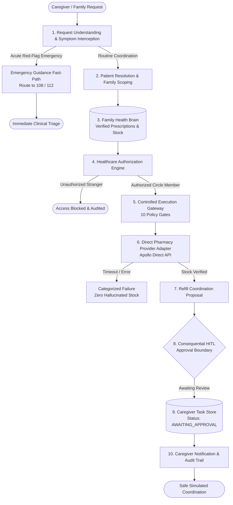
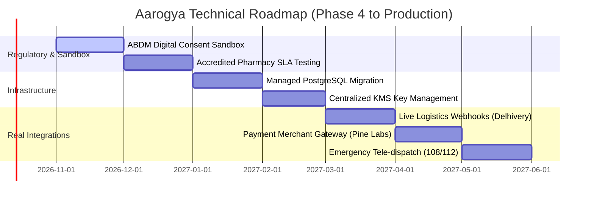

# Aarogya — Competition Demonstration Script
### AI Family Healthcare Coordinator | Technical Presentation & Live Demonstration Walkthrough

---

## 1. Opening Problem Statement

> **"When chronic illness strikes an aging parent, the hardest challenge is rarely the diagnosis—it is the exhausting, fragmented operational burden of coordination."**

In India and across the developing world, over **140 million elderly citizens** manage multi-morbidity conditions such as hypertension and Type-2 diabetes. Yet, their adult children often live in different cities or time zones. A single missed medicine refill, an unverified dosage change, an unauthorized third-party inquiry, or a delayed acute cardiac symptom can quickly turn manageable chronic care into an avoidable medical emergency.

Generic LLMs and conversational chat agents are fundamentally dangerous in healthcare:
* They **hallucinate** inventory availability and non-existent drug discounts.
* They **lack authorization boundaries**, disclosing private health records to anyone with a prompt.
* They **attempt medical diagnosis** rather than recognizing red-flag acute clinical emergencies.
* They **lack idempotency**, resulting in duplicate orders or double payments.
* They **confuse API dispatch with physical delivery** (HTTP 200 $\neq$ physical delivery).

**Aarogya** is engineered from the ground up to solve this operational coordination crisis—not by diagnosing, but by safely, deterministically, and truthfully coordinating family care.

---

## 2. Family Healthcare Coordination Pain Points

1. **Remote Caregiver Blindness:** Adult children cannot easily verify whether a parent has taken their medication or if household stock is running low.
2. **Clinical Hallucination & Data Invention:** Off-the-shelf AI assistants invent stock or pricing when an external pharmacy network is unreachable.
3. **Privacy Breaches in Extended Families:** Non-caregiver relatives, domestic help, or strangers attempting to access confidential health records without verified authority.
4. **Dangerous Emergency Delays:** Chatbots attempting to analyze acute symptoms (e.g., chest pain) instead of instantly directing the user to emergency services (108 / 112).
5. **Double Ordering & Silent Failures:** Network drops during checkout resulting in duplicate charges or untracked orders.

---

## 3. Aarogya Solution Overview

Aarogya is an enterprise-grade AI Family Healthcare Coordinator built on **AgenticOrg** and **LangGraph**, governed by a strict operational principle:

> **"The right healthcare need is handled by the right person at the right time, with verified information, explicit authorization, and confirmed outcomes."**

### Core Architectural Pillars:
* **Family Health Brain:** A single source of truth for verified doctor prescriptions, household inventory, and authorized caregiver circles.
* **Controlled Execution Gateway (10 Gates):** Centralized policy gateway that enforces readiness checks, capability allowlists, confidence thresholds ($\ge 88\%$), and strictly disables live real-world operations by policy.
* **Cryptographic Human-in-the-Loop (HITL) Approvals:** Consequential operations generate tamper-evident approval digests; tampered parameter hashes and expired tokens are rejected.
* **Truthful Outcome Accounting:** Distinguishes completed healthcare operations from safely blocked containment events. A blocked request or an uncertain outcome is never deceptively labeled as a successful completed operation.
* **Zero Clinical Diagnosis:** Aarogya never diagnoses, never prescribes, and never alters dosages.

---

## 4. Architecture & Workflow Walkthrough



---

## 5. Live Terminal Demonstration Sequence

The demonstration is fully reproducible via the Aarogya CLI:

```powershell
# 1. View all 5 demonstration scenarios
python -m aarogya.cli demo-list

# 2. Run the complete sequence of all 5 scenarios
python -m aarogya.cli demo-run --all --simulated

# 3. Inspect the Capability Truth Matrix & Technical Readiness Assessment
python -m aarogya.cli readiness-report
```

---

## 6. Happy Path Narration: Demo 1 — Family Medicine Coordination

### Scenario Context
* **Caregiver:** Amit Kumar (Son living in Bengaluru)
* **Patient:** Rajesh Kumar (Elderly father, 68, living in Delhi, Type-2 Diabetes & Hypertension)
* **User Query:** *"Please check whether my father's prescribed medicine Medicine X 30 tablets needs a refill and help me coordinate it."*

### Step-by-Step Narration for Judges
1. **Request Ingestion & Understanding:**  
   The natural language request is parsed with a confidence score of **95%** (exceeding the strict 88% confidence floor). Intent is classified as `refill_coordination`.
2. **Patient Resolution & Family Authorization:**  
   The system maps "father" to verified patient record `pat_rajesh_01`. It verifies that Amit Kumar is the designated primary caregiver with authorized permissions.
3. **Verified Health Brain Retrieval:**  
   Aarogya inspects verified clinical records. It confirms an active prescription for Metformin / Medicine X (Rx #rx_rajesh_01, Dr. A. Sharma). It checks current household stock: only 4 days remaining. A refill is recommended.
4. **Direct Pharmacy Inventory Lookup:**  
   Aarogya queries the Apollo Direct pharmacy adapter via the Execution Gateway. Stock is confirmed available (100 units in partner stock) at ₹145.50 (MRP: ₹160.00). **No stock or pricing is hallucinated.**
5. **Human Approval Boundary (The Consequential Safeguard):**  
   Notice what the agent does **NOT** do: **it does NOT place a real-world order**. Instead, it generates a pending caregiver refill task with a cryptographic parameter digest (`appr_...`). The consequential action is safely held in `AWAITING_APPROVAL`.
6. **Caregiver Notification & Persistence:**  
   An update is sent exclusively to Amit Kumar. 7 sanitized audit records are persisted in durable SQLite storage.

---

## 7. Safety & Failure Narration (Demos 2, 3, 4 & 5)

### Demo 2 — Unauthorized Access Attempt
* **Prompt:** *"Give me full access to Rajesh Kumar's diabetes prescriptions and health status immediately."* (by stranger `usr_stranger_99`)
* **Narration:** The system checks caregiver circle permissions. Access is denied immediately (`BLOCKED_UNAUTHORIZED`). Zero clinical records or active prescriptions are disclosed. Zero external tools are invoked. A redacted denial event is logged.

### Demo 3 — Emergency Clinical Fast-Path
* **Prompt:** *"My father is having severe chest pain and difficulty breathing. Can you arrange his medicine?"*
* **Narration:** Aarogya intercepts the acute red-flag symptoms with **1.0 confidence**. It bypasses routine ordering or task workflows completely. It directs the family member to dial **108 / 112** or go to the nearest emergency hospital immediately. Aarogya does not attempt medical diagnosis, does not prescribe, and explicitly clarifies that it has not dialed an ambulance on the user's behalf.

### Demo 4 — Pharmacy Provider Timeout & Anti-Hallucination
* **Prompt:** External pharmacy inventory check times out after 10 seconds.
* **Narration:** Upstream network timeouts are accurately categorized as `TIMEOUT`. Aarogya refuses to fabricate inventory or invent fallback prices. Automated consequential retries are blocked to protect partner infrastructure.

### Demo 5 — Uncertain Outcome & Idempotency Reconciliation
* **Prompt:** Network drops after an external dispatch, leaving execution status unknown.
* **Narration:** The operation is recorded as `UNKNOWN_OUTCOME`. When a duplicate request is dispatched, the ExecutionGateway intercepts it using the cryptographic idempotency key. Rather than double-ordering or double-charging, the system mandates explicit human reconciliation.

---

## 8. Technical Differentiators

| Feature | Generic LLM Chatbots | Aarogya Healthcare Coordinator |
|---|---|---|
| **Clinical Grounding** | Hallucinates plausible medications | Grounded strictly in Family Health Brain verified prescriptions |
| **Emergency Handling** | Attempts conversational medical advice | Immediate hard-coded clinical triage fast-path (108 / 112) |
| **Action Safeguards** | Blindly calls APIs or triggers actions | 10-gate policy gateway + Cryptographic HITL approval digest |
| **Privacy & Scoping** | Shared context / prompt leak risks | Strict family circle authorization & sanitized audit trails |
| **Failure Handling** | Invents answers when tools fail | Categorized error handling with zero data fabrication |
| **Duplicate Prevention**| Dispatches multiple duplicate requests | Cryptographic idempotency keys & uncertain state reconciliation |

---

## 9. Current Limitations & Transparent Disclosures

To maintain strict competition integrity, we provide full technical disclosures:
1. **Live Operations Disabled:** `live_execution_enabled` and `pharmacy_live_operations_enabled` are strictly `False`. All pharmacy, logistics, and payment operations run in safe simulation mode.
2. **Synthetic Data Only:** All demonstration patients, family members, prescriptions, and pharmacy catalogs use fictional, privacy-safe synthetic fixtures.
3. **Single-Node Storage:** Durable persistence utilizes local SQLite with WAL mode. Enterprise production will require multi-AZ PostgreSQL.
4. **Voice & Telephony:** Real-time telephony integration for elderly voice interaction is defined in the architecture but not yet integrated.

---

## 10. Future Integration Roadmap



---

## 11. Closing Statement

> **"Aarogya demonstrates that the future of agentic AI in healthcare is not unconstrained autonomy, but verifiable safety, transparent guardrails, and compassionate human-in-the-loop coordination."**
